<p align="center">
  
</p>

<h1 align="center">SPIRAL</h1>

<p align="center"><em><sub>A modern multi-database client for SQL, Redis, and MongoDB — built with Electron, React, and TypeScript.</sub></em></p>

<p align="center">
  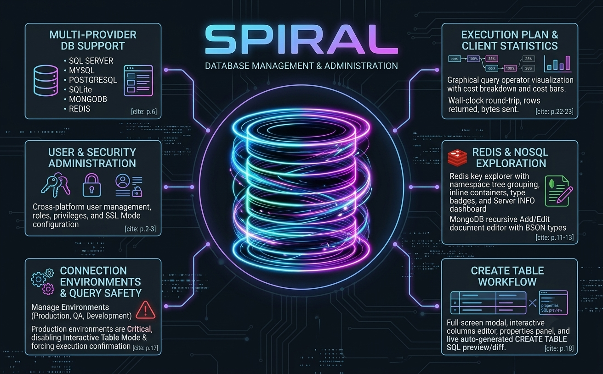
</p>

## About

Spiral is a cross-platform desktop client for managing and querying multiple database engines from one app. It pairs a lazy-loaded schema explorer with full CRUD tooling for tables, views, stored procedures, users, and more — plus dedicated dialogs for backup/restore, schema comparison, and an embedded AI assistant for writing SQL.

Developed by [Ophir Oren](https://www.linkedin.com/in/ophiroren/) using AI agents, for educational purposes. Main motivation: after moving to macOS, lacked a good tool to manage databases, create ERD diagrams, and do database profiling.

<p align="center">
  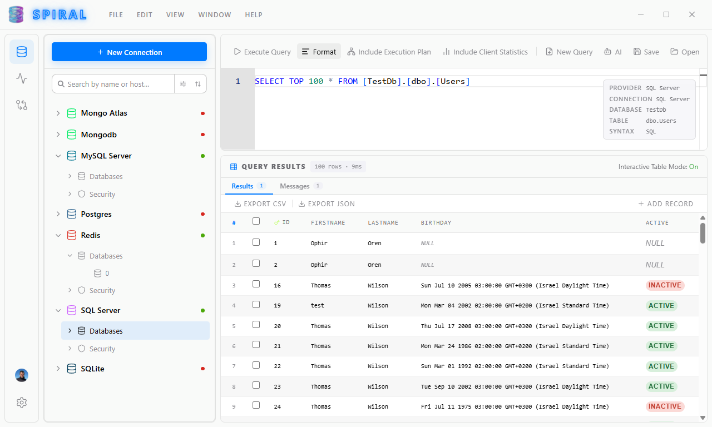
  &nbsp;
  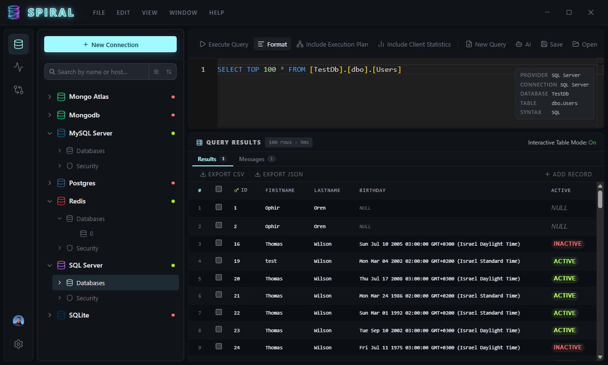
  &nbsp;
  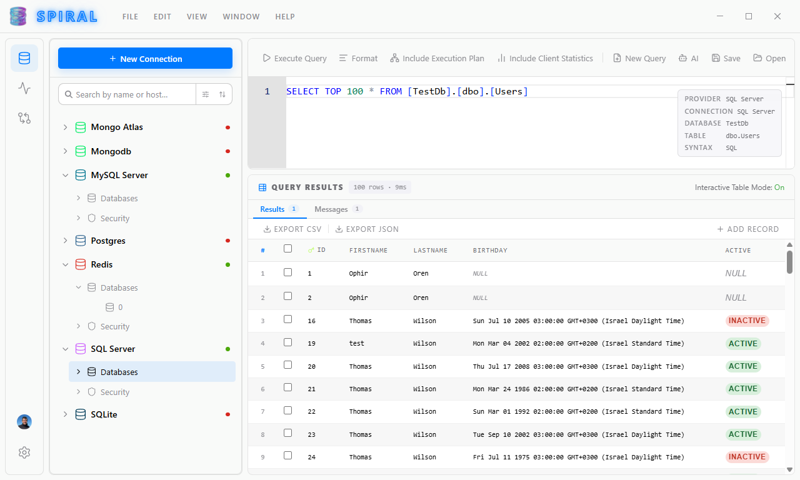
</p>

## Features

- **Multi-database support** — SQL Server, MySQL, PostgreSQL, SQLite, MongoDB, and Redis (standalone, cluster, and sentinel modes), via a pluggable provider architecture.
- **Explorer** — lazy-loaded database tree (tables, views, stored procedures, functions, types, columns, keys, constraints, triggers, indexes, statistics) with full CRUD dialogs for tables, views, stored procedures, table types, and collections.
- **Query Editor** — Monaco-based SQL/JSON/Redis-command editor with execution plans, client statistics, and result grids; MongoDB shell-style and JSON command syntax.
- **Interactive Tables** — query results render as editable grids: sort, create, and delete rows directly, with an enhanced look & feel. Auto-disabled for connections marked as a Critical environment to prevent accidental edits.
- **SQL Profiler** — dedicated profiling page with execution plan visualization, client statistics, and query result export.
- **User & Security Management** — per-provider user/role management (SQL Server logins & roles, MySQL server/database privileges, MongoDB roles, Redis ACL users).
- **Backup & Restore** — native or pure-JS engines per provider (SQL Server, MySQL, PostgreSQL, SQLite, MongoDB, Redis) with compression, scope, and conflict-resolution options.
- **Compare** — save source/target comparison configs, run schema & row-level diff reports, generate sync scripts, and execute (or revert) syncs directly against a target database.
- **Redis Dashboard** — live server `INFO` snapshot (memory, stats, persistence, replication, cache efficiency) with safe and destructive maintenance commands.
- **MongoDB Tooling** — document editor (EJSON, all BSON types), aggregation pipeline builder with live preview, and schema validation rule editor/tester.
- **AI Assistant** — local, embedded AI (SQLCoder via node-llama-cpp) for SQL help inside the Explorer.
- **Smart Execution Documentation (SED)** — task-driven panel for guided multi-step database operations.
- **Internationalization** — English and Hebrew (full RTL support), extensible via i18n locale files.
- **Connection Management** — environments (Production/QA/Dev) with color tagging, critical-environment query safeguards, SSH tunneling, TLS/SSL, auto-connect, and background schema auto-refresh.
- **Customization** — dark/light themes, resizable panels, native-feeling toolbars (macOS capsule style / Windows & Linux flat style), and a Tips & Tricks notification system.
- **Auto-Update** — built-in release checking and update flow.

> [!NOTE]
> **macOS users:** Spiral is now signed and notarized by Apple. As a result, **auto-update does not work on macOS** — you'll need to **manually download** the latest release from the [releases page](https://github.com/developer82/Spiral/releases) and reinstall to update.

### AI Assistant *(experimental)*

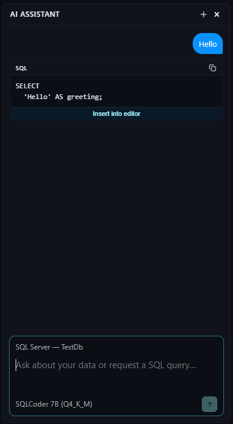

Chat with your data and build queries using natural language. The assistant runs on a **local model** — nothing leaves your machine, no data is ever sent to a remote provider, so your databases stay private. Model management (download, switch, remove) lives in **Settings → AI**, and more models are coming soon. This feature is experimental and still evolving.

<br clear="left"/>

### ERD Scheme

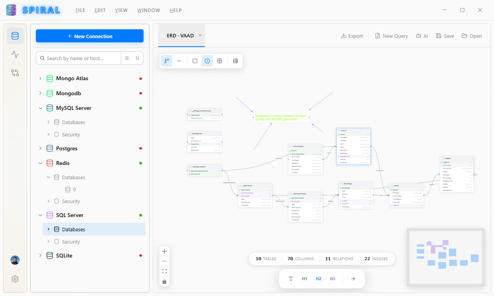

Visualize your database schema as an interactive entity-relationship diagram. Tables and their relationships are laid out automatically in a modern, draggable editor — customize the layout, annotate diagrams with notes, and export them for documentation or sharing.

<br clear="right"/>

### Query Statistics & Execution Plan

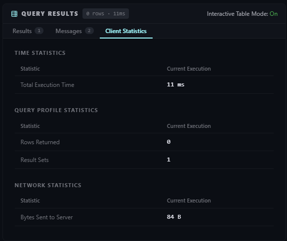

See exactly what a query costs and where the time goes. The **Execution Plan** view renders SQL Server's query plan as an interactive graph — operators, cost percentages, and row estimates per step — making it easy to spot scans, missing indexes, or expensive joins. **Client Statistics** complements it with runtime numbers (execution time, rows returned, bytes sent), so you can compare runs and confirm a change actually made a query faster, not just guess.

<br clear="left"/>

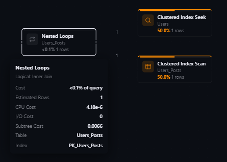

### Database Environments

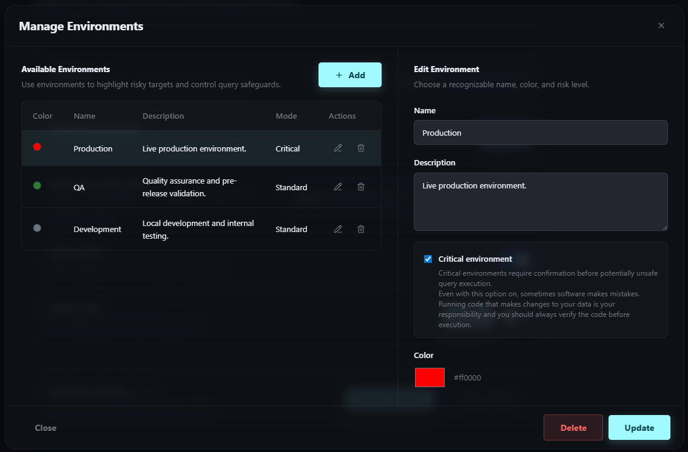

Keep Production, QA, and Development apart at a glance. Create your own named environments, give each a color, and assign them to saved connections — the color shows up throughout the Explorer so it's always clear what you're connected to. Mark sensitive environments as **Critical** to get extra guardrails: non-read-only queries prompt for confirmation before running, and Interactive Tables are automatically disabled to prevent accidental edits.

<br clear="right"/>

### Native Shells

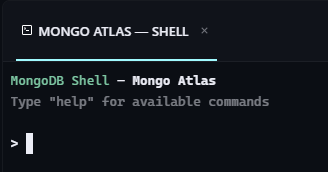

For MongoDB and Redis, the query tab acts as a native shell rather than a translated query builder. Write real `db.collection.method(...)` MongoDB shell syntax or plain Redis commands (`GET`, `HGETALL`, etc.) and run them directly against the database — no abstraction layer in between, no SQL-shaped compromise. Results come back structured (document cards for Mongo, normalized tables for Redis) so you still get a readable view on top of the raw command output.

<br clear="left"/>

### Personal & Secure

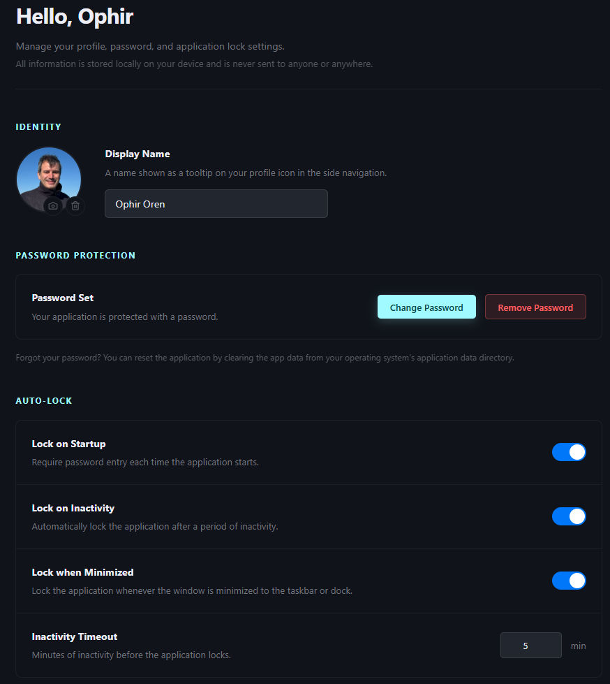

Set up a user profile — name and avatar — so the app feels like yours, not a generic tool. More importantly: everything stays local. Your profile, connections, passwords, and queries are stored on your machine and never leave it — no account, no telemetry-backed cloud sync, no remote server in the loop.

<br clear="right"/>

#### Password Protected

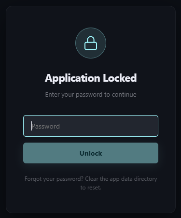

Spiral manages your saved database connections, and can remember their passwords for you. To keep that safe, you can set an application password — doing so also **encrypts every stored connection password** on disk, not just the app itself.

Once a password is set, **Auto-Lock** options control when Spiral locks itself: *Lock on Startup* (require the password every time the app launches) and *Lock on Inactivity* (lock automatically after a configurable idle timeout). When locked, a full-screen lock screen blocks access to the app until the correct password is entered — also triggered on OS suspend or screen-lock events.

There is no password recovery: forgetting it means clearing the app's user data directory to regain access.

<br clear="left"/>

## Project Setup

### Install

```bash
$ npm install
```

### Development

```bash
$ npm run dev
```

### Build

```bash
# For windows
$ npm run build:win

# For macOS
$ npm run build:mac

# For Linux
$ npm run build:linux
```

## Contributing

Spiral grows with help from people who use it. Whether it's a bug, a rough edge, or an idea for a feature — open an [issue](https://github.com/developer82/Spiral/issues) and let's talk about it. Pull requests are very welcome too. Every contribution, big or small, is genuinely appreciated.
